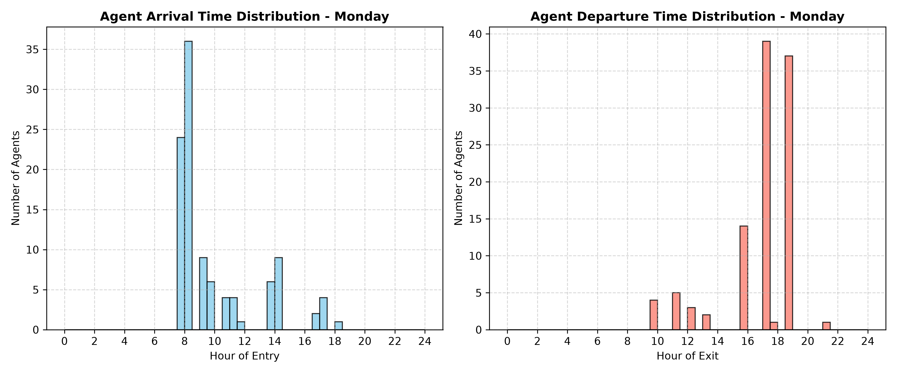

# IIT Delhi Campus Mobility Simulation (UniSim)

## Introduction: What is the simulation and why IIT Delhi
The IIT Delhi Campus Mobility Simulation (UniSim) is a microscopic, agent-based framework designed to model the high-resolution spatial and temporal mobility patterns of students, faculty, and staff. Generating data at a **1-minute timestep** across a simulated 5-day academic week, it outputs highly detailed trajectories representing pedestrian flow. IIT Delhi was chosen because it represents a densely populated, complex microcosm integrating academic, administrative, and residential zones—making it an ideal candidate for testing pedestrian flow modeling.

## Visualizations & Results
The `analyze_building_occupancy.py` acts as the primary analytical tool for the simulation. It categorizes rooms (LHC, Combined Blocks, Management Buildings, Hostels) and evaluates population count within specific building archetypes at exact 30-minute intervals (from 06:00 to 24:00). 

The outputs empirically validate the expected sharp morning exoduses from hostels leading into peak occupancy periods in the academic zones during core lecture hours (09:30 - 12:30 and 14:00 - 17:00), paired with corresponding spikes in arrival/departure metrics.

### Building Occupancy Analysis

### Arrival & Departure Distributions (Monday)

---

## Core Architecture
*   `unisim_extracted.py`: Handles agent instantiation, demographic structuring, dynamic elective assignments, and spatial home distribution.
*   `graph_io.py`: Manages the serialization of the OpenStreetMap (OSM) walk network and algorithmically bridges disconnected pathways and gates.
*   `simulation_engine.py`: Computes shortest-path Dijkstra routing, calculates exact commute durations, and interpolates minute-by-minute coordinate transitions.
*   `analyze_building_occupancy.py`: Parses the resulting schedules to aggregate campus population densities into functional zones (e.g., LHC, Hostels) at 30-minute intervals.

## Data Sources
The simulation synthesizes several real-world datasets:
*   **Campus Geography (`iitd.json`)**: An enriched GeoJSON defining the campus extracted from OpenStreetMap (OSM). Beyond basic building polygons and centroids, it provides `sub_points`. **Crucially, no coordinate in this file is randomly generated**—every `sub_point` is explicitly mapped to represent an exact physical house, residential block, or building unit within a larger complex. *Limitation*: Accuracy is entirely dependent on crowdsourced OSM data; multi-story indoor layouts are not mapped.
*   **Course Timetable (`offered courses.csv`)**: The semester ERP registry. Crucial columns utilized include `Course Code`, `Slot Name`, `Lecture Time` (parsed via Regex), `Room`, and `Vacancy` (used for lottery weights).
*   **Faculty Registry (`professor_data.csv`)**: Derived data from the IIT Delhi IRINS portal (`irins.iitd.org`). It registers exactly 829 faculty members across more than 40 departments.
*   **Student Demographics (`Seat Matrix btech.csv` & `student matrix phd.csv`)**: Intake matrices compiled from JoSAA defining branch codes and seating capacities for UG and PhD candidates.
*   **Course of Study UG & PG (`btech_curriculum.json` & `pg_curriculum.json`)**: Used for determining the syllabus of UG and PG students of various years and branches. The UG curriculum was extracted from hardcoded logic into a modular JSON for maintainability.
*   **Staff Data (`staff_data.csv`)**: Operational data used to assign locations and working hours to 490 non-teaching staff.

## Methodology

### Step 1: Agent Population Construction
Three specialized functions generate the campus agents:
1.  **Undergraduates (B.Tech)**: Generated via the seat matrix for years 1 to 4. Branches with integrated dual degrees (e.g., `CS5`, `CH7`, `MT6`, or ending in 5, 6, 7) are automatically assigned a 5-year duration. Unique IDs (e.g., `2024CE10001`) and randomized tutorial group numbers (1-4) are generated.
2.  **Postgraduates (PG)**: Instantiated from `pg_curriculum.json` for exactly 2 years. 
3.  **PhD Scholars**: Sourced from the PhD intake matrix, assumed to have a 5-year academic lifespan.
4.  **Faculty**: 829 professors are instantiated, linked to specific departments.
5.  **Staff**: 490 non-teaching staff agents are generated and categorized into two distinct operational types. 
    *   **TA/Administrative Staff** (20%, 98 members) are strictly assigned to work inside academic blocks.
    *   **Maintenance Staff** (80%, 392 members) are distributed evenly across *all* campus buildings, split into two equal 6-hour shifts.

### Step 2: Home Zone Assignment
Agents are assigned baseline GPS coordinates. To enforce realistic dispersion and accuracy, the script extracts `sub_points` from `iitd.json`. These points explicitly map agents to exact, real-world physical structures within a given polygon.
*   **B.Tech Students**: Proportionally distributed across 13 hostels.
*   **PG/PhD Students**: Assumed weighted probabilities (30% off-campus Jia Sarai, 20% Katwaria Sarai, 50% on-campus hostels).
*   **Faculty**: Mapped to real residential localities across the campus map based on housing availability percentages.
*   **Staff**: Home coordinates are directly parsed from `staff_data.csv`.

### Step 3: Schedule Assignment
The schedule generation engine assigns courses, dynamically resolves electives, and builds an hour-by-hour weekly grid.
*   **Core Courses**: Injected by matching the student's batch string against the modularized curriculum files.
*   **Electives & HUL Lottery**: Assigned to fill placeholders using a heavily constrained, vacancy-weighted probabilistic lottery.
*   **Timetable Compilation & Markovian Attendance**: Utilizes regex to parse complex lecture time strings. During compilation, a Markovian attendance filter is applied (base 75% for first class, 100% for consecutive attended classes, 50% for skipped previous classes).

### Step 4: Spatial Graph Preprocessing
Because OpenStreetMap (OSM) data is inherently imperfect, the simulation employs sophisticated graph bridging:
*   **Network Extraction**: The primary undirected pedestrian graph is downloaded via `OSMnx`.
*   **Graph Repair**: Identifies disconnected graph components and dead-end nodes, automatically creating bridged edges within a 20m spatial radius.
*   **Gate Bridging**: Explicitly detects nodes near campus gates and bridges them to boundary nodes (e.g., Katwaria Sarai gate 30m radius, Jia Sarai 50m radius).

### Step 5: Trajectory Generation
The engine translates the abstract schedules into physical 1-minute spatial trajectories.
*   **Entropy Injection**: For realism, each agent is assigned a unique, constant walking speed drawn from a uniform distribution $U(1.0, 1.4)$ m/s. A global time offset $U(-120, 120)$ seconds (± 2 minutes) is generated per agent. Class start and end minutes are shifted by a random integer $U(-5, 5)$ minutes.
*   **Routing**: Computes the exact `NetworkX` Dijkstra shortest path using actual geospatial edge coordinates (`[lon, lat]`).
*   **Back-propagation**: Commute duration $T = D / v$ is calculated. To guarantee on-time arrival, the agent's departure time is back-propagated ($Commute\_Start = Target\_Arrival\_Time - T_{duration}$).
*   **Early Dismissal Rule**: If a back-propagated departure time forces an agent to leave an ongoing class early, they are restricted to leaving *at most* 10 minutes prior to the scheduled end of that class.
*   **Optimization**: Coordinates are linearly interpolated. Only transition steps and the first/last steps of the day are physically written to disk.

---

## Assumptions
1.  **Markovian Student Attendance**: Because empirical truancy data is unavailable, the simulation assumes attendance follows a Markov chain dependency. 
2.  **Room Spatial Centroids**: Lacking detailed multi-story architectural CAD data, the model maps classes to the 2D spatial centroids of corresponding buildings. 
3.  **Constant Walking Velocity**: While baseline speeds are randomized per agent, walking velocity never changes dynamically during the simulation (due to lack of real-world telemetry for crowd slowing mechanics).
4.  **Faculty and Staff Roles & Residency**: Since empirical individual-level schedules were unavailable, staff and faculty behavior is modeled statistically via hardcoded shifts and assumed housing availability.

## Limitations
1.  **Deterministic Routing and Crowd Dynamics**: Agents inherently possess omniscient knowledge of the shortest path. Routing does not dynamically degrade due to crowd congestion or queueing at gates.
2.  **Lack of Multi-modal Transport**: All intra-campus movement is strictly treated as pedestrian. 
3.  **Verticality**: The model treats all buildings as flat geometric points without z-axis transitions (elevators/stairs).
4.  **Staff and Faculty Demographics**: Relying on statistical assumptions for housing and specific duty rosters reduces fidelity.
