# IIT Delhi Campus Mobility Simulation: Knowledge Transfer Document

## Introduction: what is the simulation and why IIT Delhi
The IIT Delhi Campus Mobility Simulation (UniSim) is a microscopic, agent-based framework designed to model the high-resolution spatial and temporal mobility patterns of students, faculty, and staff. Generating data at a **1-minute timestep** across a simulated 5-day academic week, it outputs highly detailed trajectories representing pedestrian flow. IIT Delhi was chosen because it represents a densely populated, complex microcosm integrating academic, administrative, and residential zones—making it an ideal candidate for testing pedestrian flow modeling.

## Visualizations & Results

### Campus Geography & Network
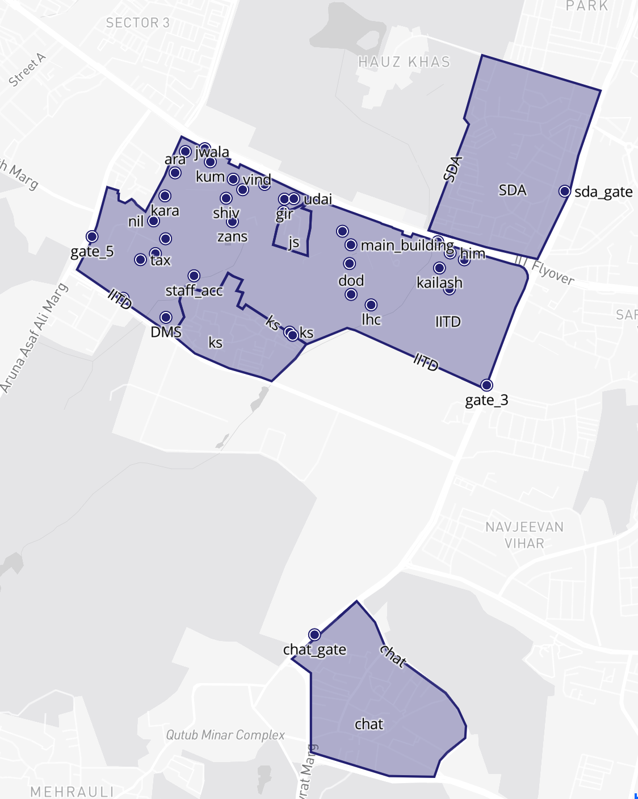 
*Figure 1: The geographic boundaries and spatial layout of the IIT Delhi campus.*

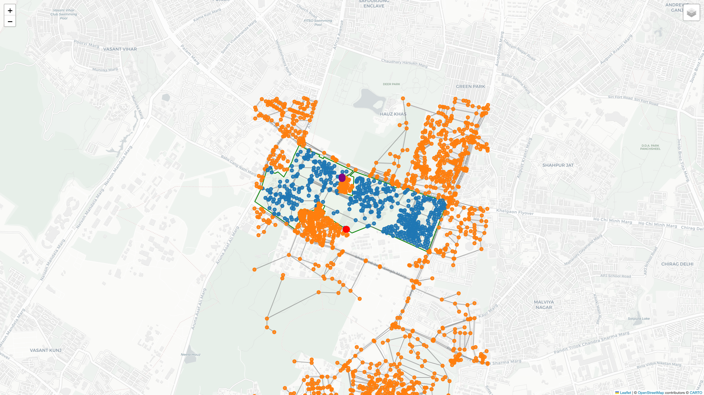 
*Figure 2: The pedestrian walk network graph showing spatial nodes and bridged edges used for agent routing.*

The `analyze_building_occupancy.py` acts as the primary analytical tool for the simulation. It categorizes rooms (LHC, Combined Blocks, Management Buildings, Hostels) and evaluates population count within specific building archetypes at exact 30-minute intervals (from 06:00 to 24:00). 

The outputs empirically validate the expected sharp morning exoduses from hostels starting around 07:30, leading into peak occupancy periods in the academic zones during core lecture hours (09:30 - 12:30 and 14:00 - 17:00), paired with corresponding spikes in arrival/departure metrics. A distinct massive dispersal event is recorded at 13:00, where academic block occupancy plummets as agents route towards messes and eateries. By 17:30, academic zones largely clear out while hostels see their highest sustained evening occupancy.

### Building Occupancy Analysis
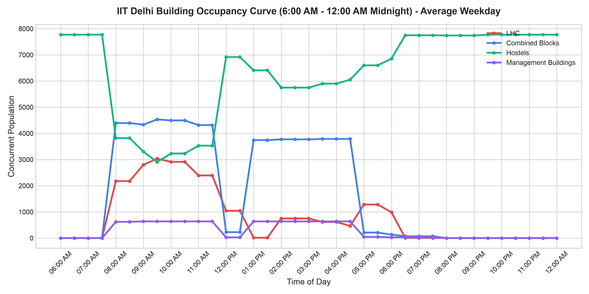
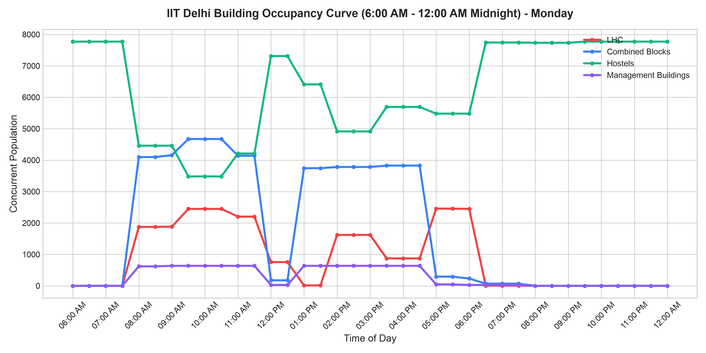
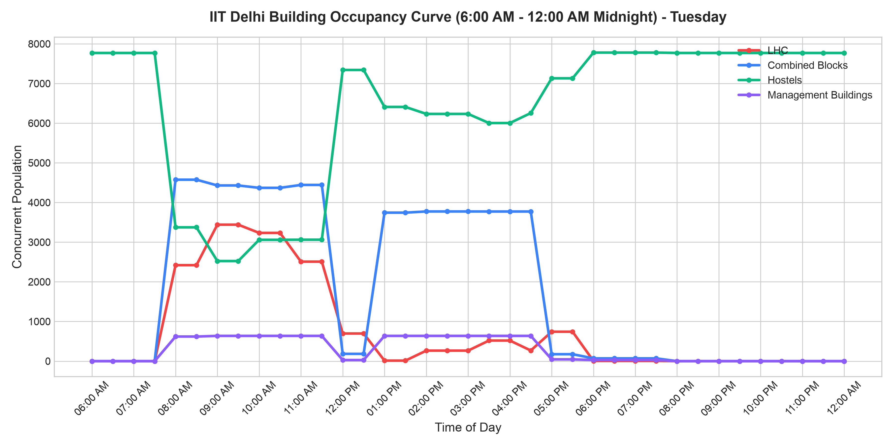
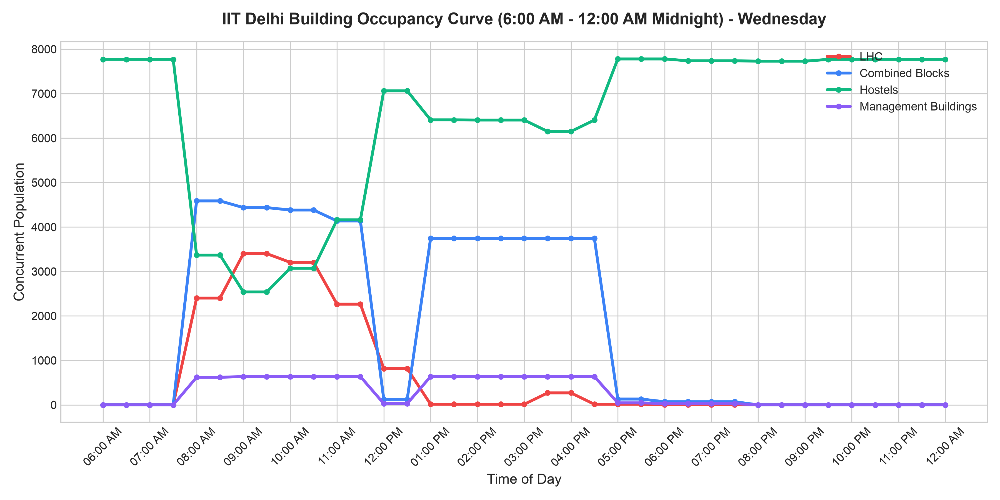
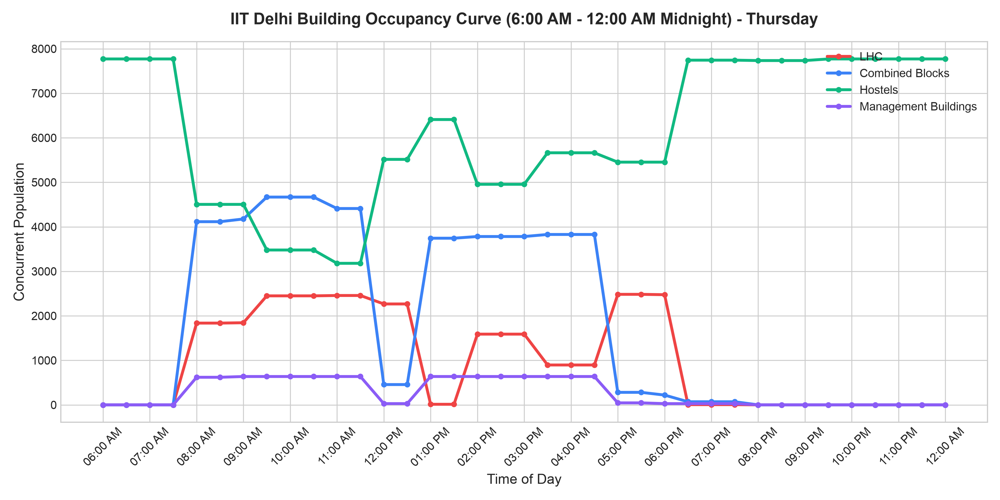
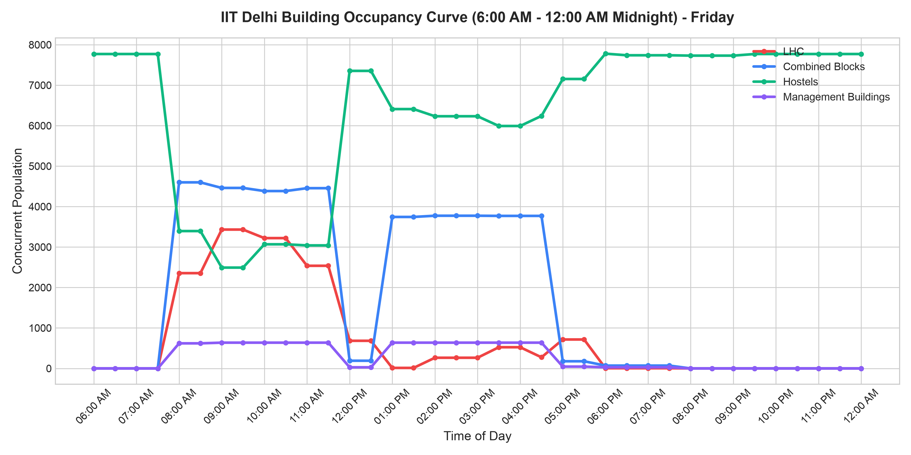

### Arrival & Departure Distributions
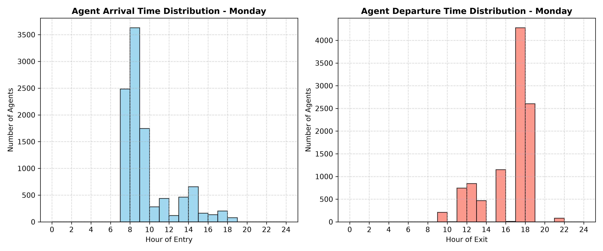
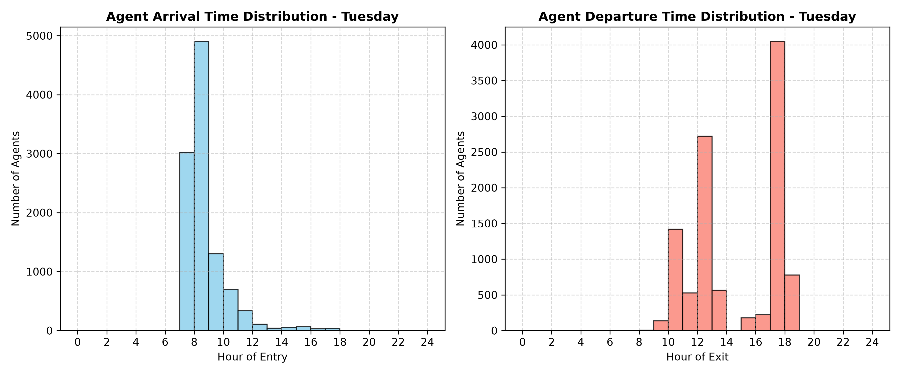
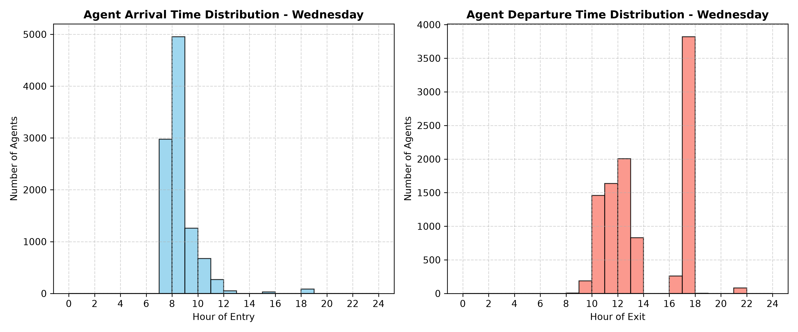
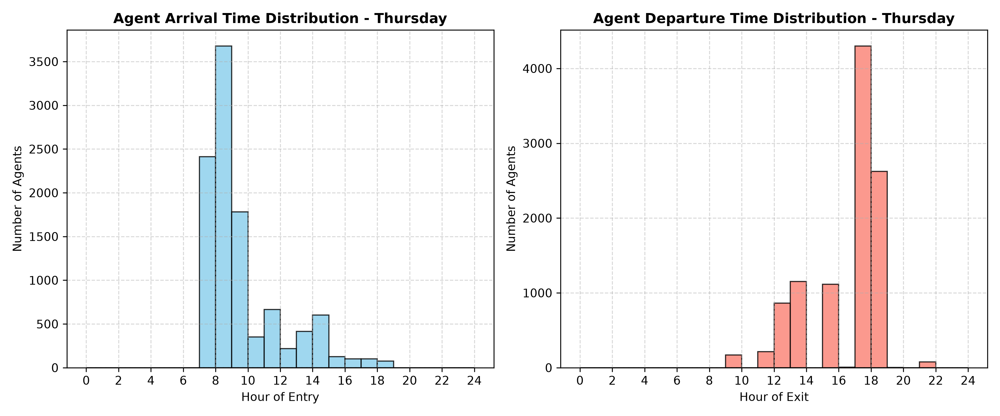
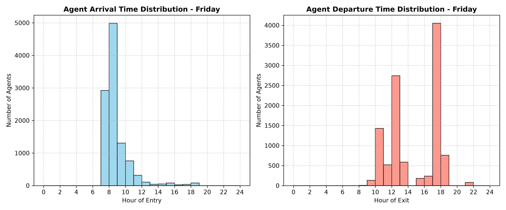

---

### Core Architecture
*   `unisim_extracted.py`: Handles agent instantiation, demographic structuring, dynamic elective assignments, and spatial home distribution.
*   `graph_io.py`: Manages the serialization of the OpenStreetMap (OSM) walk network and algorithmically bridges disconnected pathways and gates.
*   `simulation_engine.py`: Computes shortest-path Dijkstra routing, calculates exact commute durations, and interpolates minute-by-minute coordinate transitions.
*   `analyze_building_occupancy.py`: Parses the resulting schedules to aggregate campus population densities into functional zones (e.g., LHC, Hostels) at 30-minute intervals.

---

## Data sources: every dataset used, where you found it, and its limitations
The simulation synthesizes several real-world datasets:
*   **Campus Geography (`iitd.json`)**: An enriched GeoJSON defining the campus extracted from OpenStreetMap (OSM) via the Overpass API. Beyond basic building polygons and centroids, it provides `sub_points`. **Crucially, no coordinate in this file is randomly generated**—every `sub_point` is explicitly mapped to represent an exact physical house, residential block, or building unit within a larger complex. *Limitation*: Accuracy is entirely dependent on crowdsourced OSM data; multi-story indoor layouts and vertical transitions are not mapped.
*   **Course Timetable (`offered courses.csv`)**: The semester ERP registry. Crucial columns utilized include `Course Code`, `Slot Name`, `Lecture Time` (parsed via Regex), `Room`, and `Vacancy` (used for lottery weights). *Source*: IIT Delhi ERP system (anonymized/public dataset).
*   **Faculty Registry (`professor_data.csv`)**: Derived data from the IIT Delhi IRINS portal (`irins.iitd.org`). It registers exactly 829 faculty members across more than 40 departments.
*   **Student Demographics (`Seat Matrix btech.csv` & `student matrix phd.csv`)**: Intake matrices compiled from JoSAA (Joint Seat Allocation Authority) defining branch codes and seating capacities for UG and PhD candidates.
*   **Course of Study UG & PG (`btech_curriculum.json` & `pg_curriculum.json`)**: Used for determining the syllabus of UG and PG students of various years and branches. The UG curriculum was extracted from hardcoded logic into a modular JSON for maintainability. *Source*: Official IIT Delhi Courses of Study bulletin.
*   **Staff Data (`staff_data.csv`)**: Operational data used to assign locations and working hours to 490 non-teaching staff. *Source*: IIT Delhi administrative public records.

---

## Methodology: agent population construction, home zone assignment, schedule assignment, trajectory generation — step by step

### Step 1: Agent Population Construction
Three specialized functions generate the campus agents:
1.  **Undergraduates (B.Tech)**: Generated via the seat matrix for years 1 to 4. Branches with integrated dual degrees (e.g., `CS5`, `CH7`, `MT6`, or ending in 5, 6, 7) are automatically assigned a 5-year duration. Unique IDs (e.g., `2024CE10001`) and randomized tutorial group numbers (1-4) are generated.
2.  **Postgraduates (PG)**: Instantiated from `pg_curriculum.json` for exactly 2 years. 
3.  **PhD Scholars**: Sourced from the PhD intake matrix, assumed to have a 5-year academic lifespan.
4.  **Faculty**: 829 professors are instantiated, linked to specific departments.
5.  **Staff**: 490 non-teaching staff agents are generated and categorized into two distinct operational types. 
    *   **TA/Administrative Staff** (20%, 98 members) are strictly assigned to work inside academic blocks (e.g., Admin Building, Synergy Building, LHC, SIT). They work a split schedule from 09:00-12:00 and 13:00-18:00.
    *   **Maintenance Staff** (80%, 392 members) are distributed evenly across *all* campus buildings, including hostels and the central workshop. They are split into two equal 6-hour shifts: Shift 1 works 08:00-14:00 (196 members) and Shift 2 works 14:00-20:00 (196 members).

**Final Agent Counts (Total: 12,467 autonomous agents):**
*   **Undergraduate (B.Tech/Dual)**: 4,988 agents
*   **Postgraduate (PG)**: 3,110 agents
*   **PhD Scholars**: 3,050 agents
*   **Faculty**: 829 agents
*   **Staff**: 490 agents

### Step 2: Home Zone Assignment
Agents are assigned baseline GPS coordinates. To enforce realistic dispersion and accuracy, the script extracts `sub_points` from `iitd.json`. These points are not random coordinates, but rather explicitly map agents to exact, real-world physical structures (individual houses, hostel wings, or apartment units) within a given polygon.
*   **B.Tech Students**: Propotionaly distributed across 13 hostels according to assummed hostel strength.
*   **PG Students**: Assumed weighted probabilities as 30% off-campus in Jia Sarai (`JS`), 20% in Katwaria Sarai (`KS`), and 50% in standard on-campus hostels. Second-year standard PG students are hard-routed to `Dronagiri`.
*   **PhD Students**: Follow a similar 30/20/50 split.
*   **Faculty**: Mapped to real residential localities across the campus map. The probabilistic split is assumed based on availability data from the IITD housing website: SDA (44.5%), Type 4 (25.0%), Type 5 (12.5%), New Multi Story (6.25%), Nalanda Apt (6.25%), and Chattpura (5.5%).
*   **Staff**: Home coordinates are directly parsed from `staff_data.csv`, placed in Staff quarters in IIT Delhi.

### Step 3: Schedule Assignment
The schedule generation engine assigns courses, dynamically resolves electives, and builds an hour-by-hour weekly grid.
*   **Core Courses**: Injected by matching the student's batch string (e.g., `1CE`, `3CS1`) against the newly modularized `btech_curriculum.json` and `pg_curriculum.json` files.
*   **Electives & HUL Lottery**: Assigned to fill placeholders (`PE`, `DE`, `OE`, `OC`, `HUL`) using a heavily constrained, vacancy-weighted probabilistic lottery. HUL filters for the `HUL` prefix and checks the 3rd character for `L`, `V`, or `S` (restricting to valid Lecture/Seminar formats). Department electives evaluate branch-specific constraints using the `get_dept_prefixes` function (e.g., `CE1` maps to `CVL`, `CVP`). Strict collision checks ensure randomly selected electives do not overlap with registered slots.
*   **Timetable Compilation & Markovian Attendance**: The engine utilizes regex (`Th|M|T|W|F`) to parse complex lecture time strings (e.g., `W 12:00-13:00, TF 17:00-18:00`) and constructs a unified temporal dictionary mapping each day. During final compilation, a Markovian attendance filter is applied to students: base 75% attendance probability for the first class of the day or after a break. For back-to-back classes, attendance is guaranteed (100%) if the previous class was attended, but drops to 50% if the previous class was skipped. Only attended classes are passed to the trajectory generator.

### Step 4: Spatial Graph Preprocessing (`graph_io.py`)
Because OpenStreetMap (OSM) data is inherently imperfect, the simulation employs sophisticated graph bridging:
*   **Network Extraction**: The primary undirected pedestrian graph is downloaded via `OSMnx`.
*   **Graph Repair**: `graph_io.py` identifies disconnected graph components and dead-end nodes, automatically creating bridged edges if they lie within a 20m spatial radius.
*   **Gate Bridging**: The current implementation does not explicitly bridge distinct campus gates like Katwaria Sarai (`ks_gate`) or Jia Sarai (`js_gate`). Instead, it relies on the generic 20m radius bridging algorithm to seamlessly connect external enclaves if their spatial nodes are physically close enough to the campus boundary.

### Step 5: Trajectory Generation (`simulation_engine.py`)
The engine translates the abstract schedules into physical 1-minute spatial trajectories.
*   **Entropy Injection**:For realism Each agent is assigned a unique, constant walking speed drawn from a uniform distribution $U(1.0, 1.4)$ m/s. A global time offset $U(-120, 120)$ seconds (± 2 minutes) is generated per agent. Class start and end minutes are shifted by a random integer $U(-5, 5)$ minutes.
*   **Routing**: Computes the exact `NetworkX` Dijkstra shortest path using actual geospatial edge coordinates (`[lon, lat]`).
*   **Back-propagation**: Commute duration $T = D / v$ is calculated. To guarantee on-time arrival, the agent's departure time is back-propagated ($Commute\_Start = Target\_Arrival\_Time - T_{duration}$).
*   **Early Dismissal Rule**: If a back-propagated departure time forces an agent to leave an ongoing class early, the engine restricts them to leaving *at most* 10 minutes prior to the scheduled end of that class.
*   **Optimization**: Coordinates are linearly interpolated. Only transition steps (start of movement, arrival, or activity change) and the first/last steps of the day are physically written to disk.

---

## Assumptions: every assumption made, why it was made, and whether any real data was unavailable
1.  **Markovian Student Attendance**: Because empirical truancy data at an individual level is unavailable, the simulation assumes attendance follows a Markov chain dependency rather than purely independent probabilities. A base probability of 75% is used for the first class of the day or after a break. For back-to-back classes, if a student attended the previous class, they have a 100% chance of attending the next; if they skipped the previous class, there is only a 50% chance they attend the next. This mimics psychological momentum.
2.  **Room Spatial Centroids**: Lacking detailed multi-story architectural CAD data and indoor mapping, the model makes the assumption to map classes to the 2D spatial centroids of their corresponding buildings. Indoor routing (staircases, elevators) is not computed.
3.  **Constant Walking Velocity**: While baseline speeds are randomized per agent ($U(1.0, 1.4)$ m/s), it is assumed their walking velocity never changes during the simulation. This is because real-world telemetry for crowd slowing mechanics (congestion) was unavailable, necessitating a free-flow assumption.
4.  **Faculty and Staff Roles & Residency**: Because empirical individual-level schedules for non-student campus members were unavailable, the simulation models staff and faculty statistically to protect privacy. It assumes a rigid 20/80 functional split for staff (TA/Admin vs. Maintenance) with strict hardcoded shift hours. Faculty residency is assumed probabilistically based on general housing availability percentages rather than exact individual addresses.
5.  **Deterministic Routing**: Agents inherently possess omniscient knowledge of the shortest path. Routing does not dynamically degrade due to crowd congestion or weather preferences.

---

## Limitations: what could be improved with more data or time
1.  **Deterministic Routing and Crowd Dynamics**: Agents inherently possess omniscient knowledge of the shortest path. Routing does not dynamically degrade due to crowd congestion, queueing at gates, or weather preferences. With more time, a force-directed crowd flow model could be integrated.
2.  **Lack of Multi-modal Transport**: All intra-campus movement is strictly treated as pedestrian. Campus electric shuttles, personal bicycles, or external Metro commutes are excluded from the transit calculus. With external transport schedules, these modes could be superimposed on the network.
3.  **Verticality**: The model treats all buildings as flat geometric points. With accurate CAD files, z-axis vertical transitions (time spent in elevators/stairs) could be integrated for much more accurate commute duration mapping inside large blocks like LHC.
4.  **Staff and Faculty Demographics**: The current simulation relies on assumed percentages for faculty housing distribution and staff operational roles. Access to more accurate, granular data regarding actual residency numbers, specific duty rosters, and dynamic role assignments for staff and faculty would significantly improve the fidelity of the simulation.
